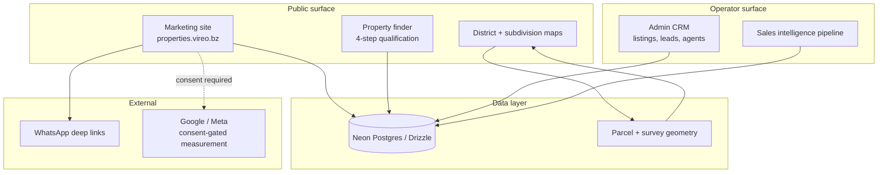

# Vireo Properties

> **Case study.** Source is private — this repo documents the architecture and the engineering decisions behind it.
> **Live:** [properties.vireo.bz](https://properties.vireo.bz)

A property discovery platform for the Belize real estate market — listings, parcel/subdivision mapping, agent attribution, and a buyer-qualification flow. Built and operated solo.

---

## The problem

Belize real estate runs on WhatsApp and Facebook groups. Prices are quoted on request, listings are photos with a phone number, and the same parcel appears three times at three prices. For a foreign buyer the failure mode is worse than inconvenience — it's not knowing whether the person you're messaging has any relationship to the property at all.

The product bet: publish the price, name the person answering for each listing, and be explicit about what has and hasn't been verified. That last part is a legal constraint as much as a design one — the platform must not imply title verification it hasn't done.

**Status:** live with real listing inventory sourced from a partner Century 21 agent. Pre-revenue — no transactions have closed through the platform.

---

## Architecture

<!-- FILL: correct this to match reality before publishing -->

Six repos back this: a marketing/CRM app, a sales intelligence pipeline, a Python parcel/GIS studio, and the listings data layer. The parcel studio is the piece that isn't obvious from the outside — surveyed subdivision plans arrive as PDFs and paper, and turning those into queryable geometry is most of the actual work.

---

## Engineering decisions

### 1. Modeling a subdivision as a first-class entity, not 30 listings

**Context.** The San Antonio Agricultural Layout is one approved subdivision — 30 residential lots averaging ~1,060 sqm, plus two open spaces, served by internal 40-foot roads, registered as a single survey entry.

**Options.**
- Create 30 independent listings. Simple, reuses the existing model.
- Model `Subdivision` as a parent entity with `Lot` children sharing survey provenance and road geometry.

**Chose** the parent entity, **because** the 30 lots share one survey, one set of approvals, and one road network — duplicating that across 30 rows means 30 places to get provenance wrong, and provenance is the entire trust proposition. It also lets the map render the actual plan rather than 30 unrelated pins.

**Tradeoff accepted.** Two entity types on every surface that lists property — search, cards, maps, and the CRM all need to handle both shapes. That's real ongoing complexity in exchange for correctness at the data layer.

---

### 2. Dual currency as a data property, not a display filter

**Context.** Belize pegs BZD to USD at 2:1. Local buyers think in BZD, foreign buyers in USD, and the two audiences hit the same pages.

**Options.**
- Store USD, convert at render.
- Store the advertised price and its currency of record, derive the other.

**Chose** storing the advertised price with its currency of record **because** the number a seller actually advertised is a fact about the listing. A rounded conversion is not the same claim, and in a market where a buyer may screenshot a price and bring it to a negotiation, the distinction matters.

**Tradeoff accepted.** Every price display carries a currency context, and the peg is now an assumption encoded in the system. If Belize ever unpegs, this needs a real FX layer — accepted deliberately rather than by accident.

---

### 3. Consent-gated analytics, defaulting to off

**Context.** The platform runs Google and Meta advertising measurement, which involves sharing hashed contact details. A meaningful share of traffic is US and EU diaspora.

**Chose** blocking all measurement until explicit consent, with decline as a first-class equally-weighted option **because** the audience is people deciding whether to trust a small Belize company with a six-figure decision. A consent banner engineered to be hard to decline is a bad first impression on exactly that dimension, and the compliance exposure isn't worth the marginal attribution data.

**Tradeoff accepted.** Attribution data is incomplete, which makes ad spend harder to evaluate.

---

### 4. Trust boundaries stated in the product, not buried in terms

**Context.** The platform shows prices and property details but has not performed independent title verification. In a market with known title disputes, implying otherwise is both a legal and an ethical problem.

**Chose** a dedicated "what we show and what you should still verify" surface, a disclaimer adjacent to price rather than in the footer, and an explicit instruction to retain an independent Belize attorney.

**Tradeoff accepted.** It costs conversions. A competitor claiming "verified listings" converts better on the landing page. The judgment is that a platform in this market survives on not being wrong about title, and that the buyers worth having are the ones who notice the honesty.

<!-- Add a 5th if you have one on the parcel/GIS ingestion — that's the most technically interesting piece. -->

---

## Walkthroughs

Surveyed subdivision plan rendered as interactive geometry — each lot carries its own dimensions and price, tied back to the registered survey entry.

Four-step finder that branches on whether the buyer is local or purchasing from abroad. The two paths need genuinely different information — a local buyer cares about road access and utilities, a foreign buyer starts from "is this person real."

---

## Stack

<!-- FILL: verify each row -->
| Layer | Tech | Why |
|---|---|---|
| Frontend | TypeScript, Next.js | SSR for listing pages — this market's buyers arrive via search and social |
| Mapping | GeoJSON, geoBoundaries | District context for buyers who don't know Belize geography |
| Parcel/GIS | Python | Survey PDFs → queryable geometry |
| Data | Neon Postgres, Drizzle ORM | Serverless scaling and type-safe database schema |
| Hosting | Vercel | Zero-config deployments for Next.js apps |

---

## What I'd do differently

If I were to rebuild Vireo, I would establish a normalized `locations` table (for districts, towns, and subdivisions) from day one, rather than relying on hardcoded location routes and ad-hoc joins. Right now, adding the location-hub taxonomy requires a risky schema migration across the `properties`, `partner_listings`, and `leads` tables to backfill relationships. Deferring that architectural decision made the initial build faster, but creating a first-class location entity later is much harder when the system is live and holding real inventory.
